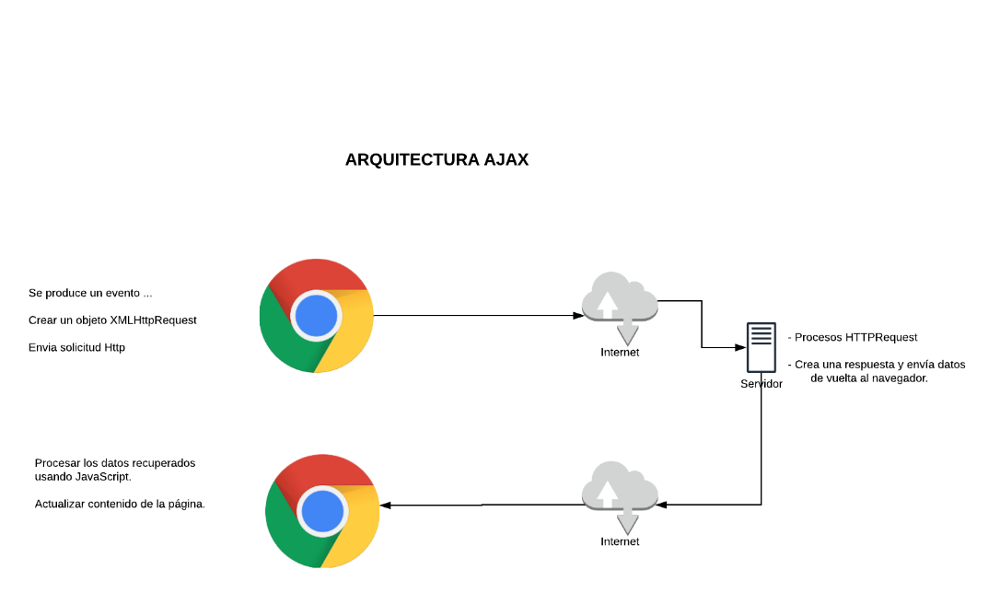

**Practica00-Consumo-de-APIs-en-la-nube**

1.  Identificar gráficamente la arquitectura y el patrón de diseño de la
    aplicación a desarrollar.

1.  Generar una llave para consumir los servicios web de la API de OMDb.

    >   Para generar la llave para consumir los servicios, se lo realiza desde
    >   la página
    >   [https://www.omdbapi.com](https://www.omdbapi.com/apikey.aspx?__EVENTTARGET=freeAcct&__EVENTARGUMENT=&__LASTFOCUS=&__VIEWSTATE=%2FwEPDwUKLTIwNDY4MTIzNQ9kFgYCAQ9kFgICBw8WAh4HVmlzaWJsZWhkAgIPFgIfAGhkAgMPFgIfAGhkGAEFHl9fQ29udHJvbHNSZXF1aXJlUG9zdEJhY2tLZXlfXxYDBQtwYXRyZW9uQWNjdAUIZnJlZUFjY3QFCGZyZWVBY2N0x0euvR%2FzVv1jLU3mGetH4R3kWtYKWACCaYcfoP1IY8g%3D&__VIEWSTATEGENERATOR=5E550F58&__EVENTVALIDATION=%2FwEdAAU5GG7XylwYou%2BzznFv7FbZmSzhXfnlWWVdWIamVouVTzfZJuQDpLVS6HZFWq5fYpioiDjxFjSdCQfbG0SWduXFd8BcWGH1ot0k0SO7CfuulN6vYN8IikxxqwtGWTciOwQ4e4xie4N992dlfbpyqd1D&at=freeAcct&Email=),
    >   se ingresan los nombres y el correo electrónico.

>   Luego de ingresar los datos, se genera un correo con la llave, antes de
>   usarla esta se debe activar con url que se adjunta en el correo.

1.  Crear un repositorio en GitHub con el nombre “Practica00 – Consumo de APIs
    en la nube”

>   **Link del repositorio**:
>   <https://github.com/damian1998/Practica00-Consumo-de-APIs-en-la-nube>

>   Desarrollar una aplicación con HTML + CSS + Javascript + Web Services para
>   buscar películas y toda su información de la base de datos de OMDb.

>   Requisitos:

-   **La aplicación Web debe permitir buscar la información de las películas
    tanto por el nombre (listado) como por el código (id) de cada película.**

>   Para que la aplicación logre cumplir con este requisito se utilizó Ajax,
>   este es un conjunto de técnicas de desarrollo web que permiten que las
>   aplicaciones web funcionen de forma asíncrona, procesando cualquier
>   solicitud al servidor en segundo plano, lo que quiere decir que realiza la
>   petición y envio de datos, y estos los plasma en pagina dependiendo de que
>   tipos de datos maneje.

>   Los datos que recuperamos del api OMDB están en formato JSON, este es un
>   formato ligero y fácil de entender tanto para las personas como para las
>   maquinas.

>   JSON es un formato de texto que es completamente independiente del lenguaje,
>   pero utiliza convenciones que son ampliamente conocidos por los
>   programadores de la familia de lenguajes C, incluyendo C, C++, C\#, Java,
>   JavaScript, Perl, Python, y muchos otros.

>   Estas propiedades hacen que JSON sea un lenguaje ideal para el intercambio
>   de datos.

>   A continuación, se muestra el código utilizado para realizar la búsqueda por
>   título de las películas.

>   Como lo dicho anteriormente se utiliza Ajax para gestionar los datos
>   recuperados desde el api, el objetivo de utilizar esta herramienta es la
>   necesidad de recuperar datos del servidor sin la necesidad de volver a
>   cargar la página.

>   Se realiza la petición de datos al servidor utilizando el siguiente enlace
>   "https://www.omdbapi.com/?apikey=e38ce2e0&s=" + titulo + "&plot=full", en
>   donde apikey es la llave que tenemos obtener para recuperar datos, como en
>   esta ocasión se necesita recuperar los datos de la película por título se
>   añade un parámetro más “s” más el título que esta almacenado en la variable
>   “titulo”, se utiliza el signo “&” para añadir más parámetros de búsqueda
>   como el “plot”, el cual retorna todos los datos correspondientes a la
>   película buscada.

>   Dentro de este método también se mandan a escribir los datos en una tabla
>   que se encuentras en la página principal (index.html).

>   Debido a que algunas películas no viene con la portada se tiene que agregar
>   una imagen para mostrar en la tabla, esto se realiza con una condicional
>   antes de mandar a escribir los datos en la pagina principal utilizando el
>   comando *document.getElementById("idElement").innerHTML = “datos a
>   escribir”;*

>   function buscarListarPeliculas() {

>   numPagina = 1;

>   var titulo = document.getElementById("nombreMovie").value;

>   document.getElementById("numPagBusc").innerHTML = " ";

>   var detalles = "";

>   if (titulo == "") {

>   detalles = "\<tr\>" +

>   "\<td colspan='5'\>No informacion disponible...\</td\>" +

>   "\</tr\>";

>   document.getElementById("tableDetallesPeliculas").innerHTML = detalles;

>   } else {

>   if (window.XMLHttpRequest) {

>   xmlhttp = new XMLHttpRequest();

>   } else {

>   xmlhttp = new ActiveXObject("Microsoft.XMLHTTP");

>   }

>   xmlhttp.onreadystatechange = function () {

>   if (this.readyState == 4 && this.status == 200) {

>   data = JSON.parse(this.responseText)

>   console.log(Math.round((data.totalResults)/10));

>   totalResult = Math.round((data.totalResults)/10);

>   document.getElementById("totalResults").innerHTML = data.totalResults;

>   if(totalResult==0){

>   document.getElementById("totalPaginasMost").innerHTML = 1;

>   }else{

>   document.getElementById("totalPaginasMost").innerHTML = totalResult;

>   }

>   desactivar();

>   data.Search.forEach(movie =\> {

>   var imagen = movie.Poster;

>   if(imagen=="N/A"){

>   imagen = "sinImagen.jpg";

>   }

>   detalles += "\<tr\>" +

>   "\<td\>\<a href='\#' style='text-decoration:none' onclick=\\"buscarPorID('"
>   + movie.imdbID + "')\\"\>'\<i class='fa fa-eye'\>\</i\>'\</a\>" +

>   "\<td\>" + movie.Title + "\</td\>" +

>   "\<td\>" + movie.Year + "\</td\>" +

>   "\<td\>" + movie.Type + "\</td\>" +

>   "\<td\>\\</td" +

>   "\</tr\>";

>   });

>   document.getElementById("tableDetallesPeliculas").innerHTML = detalles;

>   }

>   };

>   xmlhttp.open("GET", "https://www.omdbapi.com/?apikey=e38ce2e0&s=" + titulo +
>   "&plot=full", true);

>   xmlhttp.send();

>   }

>   }

>   También dentro del método buscar por título se llama al método buscar por
>   id, este se implementa en cada literal de cada uno de los datos mediante un
>   enlace para luego a través de este llamar a dicho método y mostrar los
>   detalles de una película en particular.

>   Luego este método llama a otro el cual es similar al de buscar las películas
>   por titulo, este método muestra todos los datos de una película enviando el
>   id.

>   Esta petición se realiza mediante el siguiente enlace
>   "https://www.omdbapi.com/?i=" + idP +"&apikey=e38ce2e0&s", el parámetro
>   “idP” contiene el id de la película solicitada.

>   function buscarPorID(id) {

>   data.Search.forEach(movieB =\> {

>   if (movieB.imdbID == id) {

>   DataFullMuvies(id);

>   }

>   });

>   overlay = document.getElementById('overlay');

>   popup = document.getElementById('popup');

>   overlay.classList.add('active');

>   popup.classList.add('active');

>   }

-   **Además, se deberá visualizar toda la información disponible (plot=full) de
    la base de datos de películas.**

>   Los datos recuperados de las películas como lo dicho antes se almacenan en
>   una tabla mediante javascript, con las funciones antes mostradas.

-   **También, la aplicación deberá presentar un máximo de 10 películas por
    búsqueda. Es decir, si la búsqueda retorna más de 10 películas se deberá
    paginar los resultados.**

>   Debido a que cada consulta de vuele 10 películas por página, se realiza una
>   consulta dependiendo de la página que uno quiera solicitar, para esto se
>   realizó tres funciones, dos funciones para pasar a la siguiente página y
>   regresar a la anterior y otra función que permite buscar por página.

>   Para realizar estas peticionas se utilizó el siguiente enlace:
>   "https://www.omdbapi.com/?apikey=e38ce2e0&s=" + titulo + "&plot=full&page="
>   + numPaginaAct”, en donde el parámetro “page” indita la página de resultados
>   que se quiera mostrar, los datos se muestran de igual forma en que lo hacen
>   en los métodos anteriores.

>   function paginar(numPaginaAct) {

>   var titulo = document.getElementById("nombreMovie").value;

>   var detalles = "";

>   desactivar();

>   console.log(numPagina);

>   if (titulo == "") {

>   detalles = "\<tr\>" +

>   "\<td colspan='5'\>No informacion disponible...\</td\>" +

>   "\</tr\>";

>   document.getElementById("tableDetallesPeliculas").innerHTML = detalles;

>   } else {

>   if (window.XMLHttpRequest) {

>   xmlhttp = new XMLHttpRequest();

>   } else {

>   xmlhttp = new ActiveXObject("Microsoft.XMLHTTP");

>   }

>   xmlhttp.onreadystatechange = function () {

>   if (this.readyState == 4 && this.status == 200) {

>   data = JSON.parse(this.responseText)

>   data.Search.forEach(movie =\> {

>   var imagen = movie.Poster;

>   if(imagen=="N/A"){

>   imagen = "sinImagen.jpg";

>   }

>   detalles += "\<tr\>" +

>   "\<td\>\<a href='\#' style='text-decoration:none' onclick=\\"buscarPorID('"
>   + movie.imdbID + "')\\"\>'\<i class='fa fa-eye'\>\</i\>'\</a\>" +

>   "\<td\>" + movie.Title + "\</td\>" +

>   "\<td\>" + movie.Year + "\</td\>" +

>   "\<td\>" + movie.Type + "\</td\>" +

>   "\<td\>\\</td" +

>   "\</tr\>";

>   });

>   document.getElementById("tableDetallesPeliculas").innerHTML = detalles;

>   }

>   };

>   xmlhttp.open("GET", "https://www.omdbapi.com/?apikey=e38ce2e0&s=" + titulo +
>   "&plot=full&page=" + numPaginaAct, true);

>   xmlhttp.send();

>   }

>   }

>   function irPagina() {

>   var numPaginaAct =document.getElementById("numPagBusc").value;

>   var titulo = document.getElementById("nombreMovie").value;

>   var detalles = "";

>   if (numPaginaAct \>totalResult) {

>   detalles = "\<tr\>" +

>   "\<td colspan='5'\>Numero de pagina fuera de limite..\</td\>" +

>   "\</tr\>";

>   document.getElementById("tableDetallesPeliculas").innerHTML = detalles;

>   document.getElementById("numPagAct").innerHTML = "---";

>   } else {

>   if (window.XMLHttpRequest) {

>   xmlhttp = new XMLHttpRequest();

>   } else {

>   xmlhttp = new ActiveXObject("Microsoft.XMLHTTP");

>   }

>   xmlhttp.onreadystatechange = function () {

>   if (this.readyState == 4 && this.status == 200) {

>   data = JSON.parse(this.responseText)

>   numPagina = 0;

>   numPagina = parseInt(numPaginaAct) ;

>   desactivar();

>   data.Search.forEach(movie =\> {

>   var imagen = movie.Poster;

>   if(imagen=="N/A"){

>   imagen = "sinImagen.jpg";

>   }

>   detalles += "\<tr\>" +

>   "\<td\>\<a href='\#' style='text-decoration:none' onclick=\\"buscarPorID('"
>   + movie.imdbID + "')\\"\>'\<i class='fa fa-eye'\>\</i\>'\</a\>" +

>   "\<td\>" + movie.Title + "\</td\>" +

>   "\<td\>" + movie.Year + "\</td\>" +

>   "\<td\>" + movie.Type + "\</td\>" +

>   "\<td\>\\</td" +

>   "\</tr\>";

>   });

>   document.getElementById("tableDetallesPeliculas").innerHTML = detalles;

>   }

>   };

>   xmlhttp.open("GET", "https://www.omdbapi.com/?apikey=e38ce2e0&s=" + titulo +
>   "&plot=full&page=" + numPaginaAct, true);

>   xmlhttp.send();

>   }

>   }

>   Las siguientes funciones se utilizan para los botones de siguiente y
>   anterior página, estas funciones están enlazadas a las anteriores para
>   mostrar los datos.

>   function siguientePagina() {

>   numPagina = numPagina + 1;

>   console.log(numPagina);

>   paginar(numPagina);

>   }

>   function anteriorPagina() {

>   // console.log(numPagina);

>   numPagina = numPagina - 1;

>   paginar(numPagina);

>   }

>   function desactivar() {

>   var vacio =" ";

>   document.getElementById("numPagAct").innerHTML = vacio;

>   var botonAtras = document.getElementById("atrasbtn");

>   var botonSiguiente = document.getElementById("siguientebtn");

>   document.getElementById("numPagAct").innerHTML = numPagina;

>   botonSiguiente.disabled = false;

>   if(numPagina==1){

>   botonAtras.disabled = true;

>   }else {

>   botonAtras.disabled = false;

>   }

>   if(numPagina\<totalResult){

>   botonSiguiente.disabled = false;

>   }else if(numPagina==totalResult){

>   botonSiguiente.disabled = true;

>   }

>   if(totalResult==0){

>   botonSiguiente.disabled = true;

>   botonAtras.disabled = true;

>   }

>   }

-   **Por último, la interfaz gráfica de aplicada debe ser intuitiva y sencilla
    aplicando conceptos de experiencia de usuario (justificar en el informe).**

>   La página utiliza ventanas *popup* las cuales son agradables a la vista y no
>   se tienen que usar paginas extras para mostrar la información de las
>   películas de esta manera se pueden visualizar los datos de una manera más
>   fácil y rápida, de igual forma todas las películas que se recuperan del
>   servidor se muestran en una tabla, con el título, tipo, año y la portada
>   para que se pueda identificar de mejor manera una película en particular.

>   La navegación en la página es muy sencilla debido a que no existen muchos
>   componentes, de esta manera el usuario no se pierde en sus funciones, se
>   incluyó un buscador en donde se ingresa el número de página de resultados a
>   la cual se quiera ingresar, también está a la vista el número de resultados
>   disponibles por búsqueda, y de igual forma se visualiza el numero de la
>   página en la cual el usuario se encuentra.

>   La página contiene colores oscuros para que sea más sencillo para el usuario
>   leer e identificar los datos evitando la fatiga visual, esto es muy bueno
>   para las personas que pasan mucho tiempo frente a un ordenador cualquier
>   dispositivo móvil.

1.  Realizar varios commits en la herramienta GitHub que demuestren el
    desarrollo de la aplicación.

>   **CONCLUSIONES**:

-   Los estudiantes podrán identificar arquitecturas web utilizando servicios en
    la nube. Así como también, podrán consumir APIs y manipular objetos JSON.

-   Se implemento una estructura web utilizando Ajax, esta técnica se ha vuelto
    muy popular hoy en día en el campo del desarrollo web ya que brinda gran
    capacidad de manejo de datos en formularios de registro, despliegue de
    catálogo de productos, sugerencia en la entrada de datos, etc. Ajax también
    produce una considerable optimización de recursos.

-   Se logro diseñar una página atendiendo a la facilidad de uso por parte de
    los usuarios, que además es óptima a la hora de navegar y buscar información
    de cierta película.

-   Para presentar los datos se usó el formato JSON, este está basado en texto
    estándar para presentar los datos estructurados en la sintaxis de objetos de
    JavaScript, este formato permite transmitir datos en aplicaciones web, como
    es en este caso se transmiten los datos de las películas desde la API OMDb.
